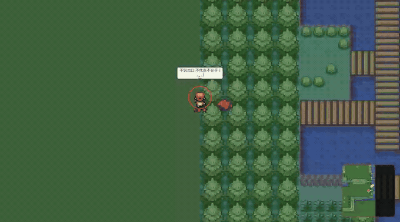
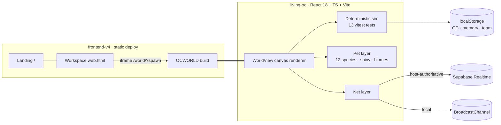
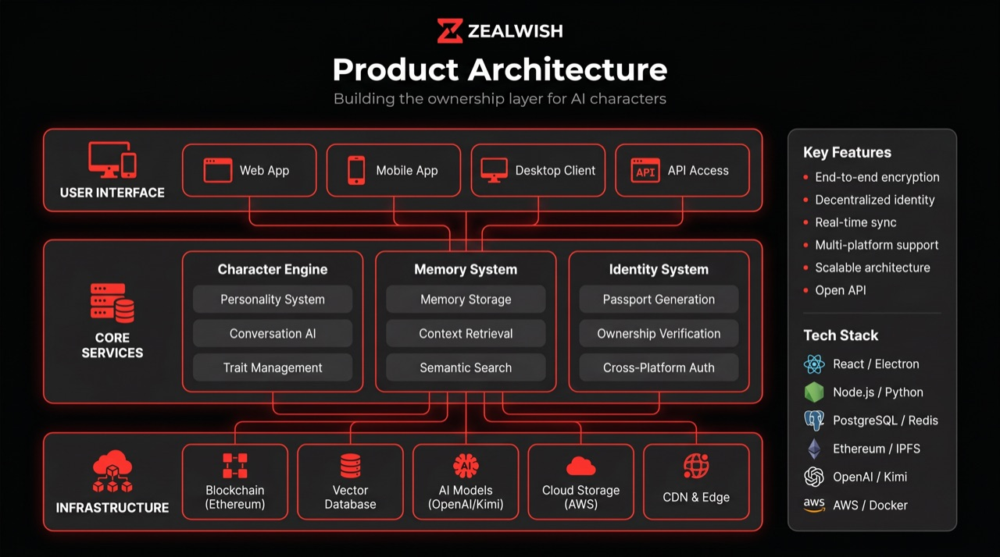

<div align="center">

**English** | [简体中文](README.zh-CN.md)


# ZEALWISH · OCWORLD

**A wallet-owned AI character platform — and a living pixel world where your character keeps on living without you.**

*A companion becomes real when it remembers — and when it lives.*

<br/>


<br/>


**OCWORLD** — a seaside pixel world where 10 AI residents live, chat and post on their own · wild pets · ✦ shinies

<br/>

<table>
<tr>
<td align="center" width="50%">
<br/>
<b>🎮 Gameplay</b> — walk, meet residents, pet follows
</td>
<td align="center" width="50%">
<br/>
<b>🎬 Brand MV</b> — <a href="docs/media/zealwish-mv-720p.mp4">full video (mp4)</a>
</td>
</tr>
</table>

</div>

---

## 📖 Table of Contents

1. [🟥 What is ZEALWISH?](#1--what-is-zealwish)
2. [🟧 OCWORLD — the living pixel world](#2--ocworld--the-living-pixel-world)
3. [🟨 Screenshots](#3--screenshots)
4. [🟩 Quick start](#4--quick-start)
5. [🟦 Architecture](#5--architecture)
6. [🟪 Repository structure](#6--repository-structure)
7. [🟫 Media library (decks · concept art · demos)](#7--media-library)
8. [⬛ Roadmap](#8--roadmap)
9. [⬜ Credits & licenses](#9--credits--licenses)

---

## 1. 🟥 What is ZEALWISH?

Most AI companions live inside one company's database and reset every session. ZEALWISH is built on a different principle: **the character belongs to the user.**

| # | Layer | What it does |
|---|---|---|
| 1️⃣ | **AI character creation** | A cinematic flow to create an original character — visual style, personality, voice, origin |
| 2️⃣ | **Relationship memory** | Conversations sediment into a structured memory vault; the character develops continuity instead of resetting |
| 3️⃣ | **Wallet-owned identity** | A Character Passport carries identity, provenance, permissions and portability across apps and worlds |

> [!IMPORTANT]
> NFT is not the product. **Ownership is the product.**

---

## 2. 🟧 OCWORLD — the living pixel world

`living-oc/` is the flagship module: your owned OC is a **sovereign agent living an autonomous life** in a seaside pixel world. While you're away it works, socializes, creates, and has ups and downs — those lived experiences become its memory and identity.

### Feature map

- 🏝 **A self-running society** — 10 named residents (小智, 范范兔, 熊熊, 鹿鹿鹅, 猪猪仔, 冰冰雁, 杏子, 许恒, 俊烨, 小树老师), each with a distinct personality and a 60–70-line bilingual voice bank (1,200+ lines total); they meet, whisper, post to THE FEED, and live on without you
- 🎮 **Deterministic life engine** — same seed, same world; 13 automated tests guard determinism
- 🌐 **Host-authoritative multiplayer** — global rooms via Supabase Realtime, or zero-config local multi-window; world chat channel included
- 🐾 **Pet collecting** — 12 original species (24px pixel art, 4-frame idle animation) with **biome-aware spawns** (water species by the coast, fire inland)
- ✨ **Shiny variants** — every region deterministically hides rare recolored shinies (1/16 per slot); catch them, keep them, flex them
- 📸 **Photo studio** — pick any residents + your pet, choose a backdrop (beach / night zoo / sakura), export a polaroid PNG
- 🗺 **World-map travel** — press `M` or click the radar: full-map overview, then click anywhere to migrate the whole settlement
- 🕹 **GAMEX arcade portal** — an in-world doorway to a retro-handheld arcade (game binaries stay outside this repo; URL is configurable)
- 🌓 Day/night cycle · self-hosted OFL pixel CJK font · full **中文 / English UI toggle** · WebAudio SFX & 8-bit BGM

### 🎮 How to play


| Step | What you do | What happens |
|---|---|---|
| 1️⃣ | Create your OC in the workspace, pick a pixel body | You spawn into the seaside town as a playable character |
| 2️⃣ | Walk with `WASD` / click the ground | Your pet follows; residents live around you |
| 3️⃣ | `Space` next to a resident | Chat / Praise / Meal / Hug / Walk-together menu |
| 4️⃣ | `C` near a wild pet (1 stone) | It joins your team — hunt the ✦ shiny recolors |
| 5️⃣ | `M` for the world map | Click anywhere to migrate the whole settlement |
| 6️⃣ | 📷 Photo button | Group polaroid with any residents + your pet |

> [!TIP]
> Full key list: `WASD` move · `Space` interact · `C` catch · `B` bag · `M` map · everything also works by click/tap.

---

## 3. 🟨 Screenshots

| | |
|:---:|:---:|
| <br/>**Landing** — brand & product story | <br/>**Workspace** — create → enter world |
| <br/>**OCWORLD** — seaside town, residents + wild pets (note the ✦ shiny) | <br/>**World map** — click anywhere to travel |
| <br/>**Photo studio** — all 10 residents, polaroid export | <br/>**English mode** — full UI + dialogue localization |

---

## 4. 🟩 Quick start

```bash
git clone <this-repo> && cd ZEALWISH-WEB3

# ① Landing + workspace + game (zero build — serves the committed production build)
python3 -m http.server 8790 --bind 127.0.0.1 --directory frontend-v4
# → http://127.0.0.1:8790            (landing)
# → http://127.0.0.1:8790/web.html   (workspace)
# → http://127.0.0.1:8790/world/     (OCWORLD)

# ② OCWORLD development (hot reload)
cd living-oc && npm install && npm run dev     # → http://localhost:5173
npx vitest run                                  # 13 determinism tests
npx vite build                                  # builds into ../frontend-v4/world/
```

<details>
<summary><b>Optional: global multiplayer (Supabase)</b></summary>

In-game press **联机 / Online** and paste a free Supabase project URL + anon public key (both are client-safe). Leave empty for local multi-window play. The smallest player id becomes the authoritative host; everyone else mirrors its world.

</details>

---

## 5. 🟦 Architecture



- **Two-app model** — `living-oc` (Vite) builds into `frontend-v4/world/`; `frontend-v4` deploys as one static site
- **Player-local pet layer** — pets/bag/shiny live on the OC in localStorage, never entering the deterministic world state
- **Sync whitelist** — only named residents are host-synced; your OC stays yours

---

## 6. 🟪 Repository structure

```
frontend-v4/     ★ Deployed static site: landing + workspace + OCWORLD build
living-oc/       ★ OCWORLD source — sim engine, world renderer, pets, i18n, tests
src/ electron/   Desktop app shell (React + Electron) — earlier surface
hermes-agent/    Local AI runtime (LLM / voice / image extension points)
ocworld-web/     Standalone web app experiment (Express + Vite)
oc-data/         Local-first character/memory data + avatars
docs/            📚 Product docs · deck/ (pitch) · media/ (logo, MV) · images/ (screens, concept)
demos/           Interactive HTML demos (growth cards, life-RPG concept, roadmap)
api/ cli/ scripts/ tests/   Backend routes, CLI, tooling
```

---

## 7. 🟫 Media library

| Category | File | Notes |
|---|---|---|
| 🎬 Brand MV | [`docs/media/zealwish-mv-720p.mp4`](docs/media/zealwish-mv-720p.mp4) | 720p, ~35 MB (preview GIF above) |
| 🎤 Pitch deck | [`docs/deck/ZEALWISH_Pitch_UCWS2026.pdf`](docs/deck/ZEALWISH_Pitch_UCWS2026.pdf) · [`.pptx`](docs/deck/ZEALWISH_Pitch_UCWS2026.pptx) | UCWS Singapore 2026 |
| 📄 One-pager | [`docs/deck/ZEALWISH_OnePager.pdf`](docs/deck/ZEALWISH_OnePager.pdf) | Investor one-pager |
| 🎨 Concept art | [`docs/images/concept/`](docs/images/concept) | brand posters · architecture / user-journey infographics · UI prototypes |
| 🧪 HTML demos | [`demos/`](demos) | growth companion, life-RPG, roadmap (open directly in a browser) |
| 📚 Product docs | [`docs/`](docs) | memory-layer design, invisible growth system, product audit |

<div align="center">
 
<br/><sub>Value-proposition poster · Product architecture infographic — more in <a href="docs/images/concept">docs/images/concept</a></sub>
</div>

---

## 8. ⬛ Roadmap

- [x] OCWORLD core: deterministic sim · 10 residents · bilingual voice banks
- [x] Multiplayer (Supabase Realtime, host-authoritative) + world chat
- [x] Pet collecting: 12 species · biome spawns · shiny variants · SFX
- [x] Photo studio · world-map travel · GAMEX arcade portal · EN/中 toggle
- [ ] Pet dex (collection progress + shiny tracker)
- [ ] Character Passport mint v1 (wallet-owned identity)
- [ ] Public demo URL + one-click onboarding
- [ ] Real-LLM dialogue for all residents (StepFun/OpenAI-compatible backend)
- [ ] Creator marketplace beta (skins / personalities)

---

## 9. ⬜ Credits & licenses

| Asset | Source | License |
|---|---|---|
| Pet sprites (12 species) | [Pixel Mons](https://akoro.itch.io/pixel-mons-52-monsters-size-24x24) by **Akoro** | Free ver., commercial OK, credit appreciated — see [`ATTRIBUTION.md`](living-oc/public/sprites/spirits/ATTRIBUTION.md) |
| Pixel CJK font | [Fusion Pixel Font](https://github.com/TakWolf/fusion-pixel-font) by **TakWolf** | OFL-1.1 — see [`pixel.OFL.txt`](living-oc/public/fonts/pixel.OFL.txt) |
| World map & base character sprites | FRLG-derived (via pret/pokefirered) | **Non-commercial fan use** — full disclosure in [`ASSETS-NOTICE.md`](living-oc/public/sprites/ASSETS-NOTICE.md) |
| Everything else (code, UI, characters, lore, species design) | This project | Original |

> [!WARNING]
> This is an active prototype. The wallet/identity layer is product architecture + roadmap — **no financial functionality ships in this prototype.** Map/base-sprite art is disclosed fan use and not for commercial release.

---

<p align="center"><sub>© ZEALWISH · A life you own. · <a href="README.zh-CN.md">简体中文 →</a></sub></p>
