<div align="center">

[English](README.md) | **简体中文**

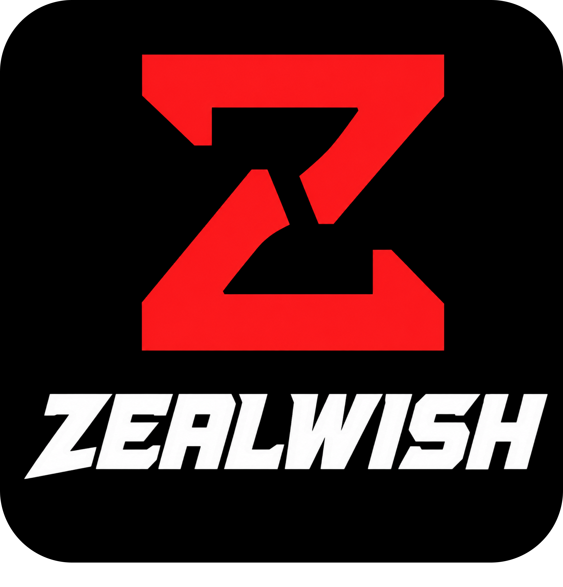

# ZEALWISH · OCWORLD

**钱包所有制的 AI 角色平台 —— 以及一个你不在时、角色也自己活着的像素世界。**

*当它记得你、并自己活着时,陪伴才成真。*

<br/>


<br/>

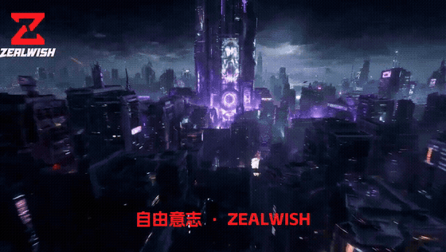

*品牌 MV 预览 —— 完整视频:[`docs/media/zealwish-mv-720p.mp4`](docs/media/zealwish-mv-720p.mp4)*

</div>

---

## 📖 目录

1. [🟥 ZEALWISH 是什么?](#1--zealwish-是什么)
2. [🟧 OCWORLD —— 活着的像素世界](#2--ocworld--活着的像素世界)
3. [🟨 截图](#3--截图)
4. [🟩 快速开始](#4--快速开始)
5. [🟦 架构](#5--架构)
6. [🟪 仓库结构](#6--仓库结构)
7. [🟫 素材库(路演 · 概念图 · 演示)](#7--素材库)
8. [⬛ 路线图](#8--路线图)
9. [⬜ 致谢与许可](#9--致谢与许可)

---

## 1. 🟥 ZEALWISH 是什么?

大多数 AI 伴侣活在某家公司的数据库里,每次对话都会重置。ZEALWISH 建立在另一条原则上:**角色应当属于用户。**

| # | 层 | 做什么 |
|---|---|---|
| 1️⃣ | **AI 角色创建** | 沉浸式流程创建原创角色 —— 视觉风格、性格、语音、背景 |
| 2️⃣ | **关系记忆** | 对话沉淀为结构化记忆库,角色形成连续性而非每次清零 |
| 3️⃣ | **钱包所有制身份** | 角色护照(Character Passport)承载身份、来源、权限,跨应用/跨世界可携带 |

> [!IMPORTANT]
> NFT 不是产品。**所有制才是产品。**

---

## 2. 🟧 OCWORLD —— 活着的像素世界

`living-oc/` 是旗舰模块:你拥有的 OC 是一个**有自己人生的主权 agent**,住在一座海边像素世界里。你不在时,它打工、社交、创作、经历起落 —— 这些亲历沉淀成它的记忆与自我。

### 功能地图

- 🏝 **自运转小社会** —— 10 位具名居民(小智、范范兔、熊熊、鹿鹿鹅、猪猪仔、冰冰雁、杏子、许恒、俊烨、小树老师),每人有独特性格与 60–70 条中英双语台词库(全库 1200+ 条);他们相遇、说悄悄话、在 THE FEED 发帖,不用你在场
- 🎮 **确定性生命引擎** —— 同种子同世界;13 项自动化测试守护确定性
- 🌐 **主机权威联机** —— Supabase Realtime 全球同房,或零配置本机多窗口;自带世界频道聊天
- 🐾 **宠物收集** —— 12 个原创物种(24px 原生像素、4 帧待机动画),**按生态分布**(水系在海岸、火系在内陆)
- ✨ **闪光变体** —— 每个区域确定性地藏着稀有换色闪光(每槽位 1/16);可收服、永久保留
- 📸 **合照馆** —— 任选居民 + 随行宠,挑背景(海边/夜园/樱花),导出宝丽来 PNG
- 🗺 **全图旅行** —— 按 `M` 或点雷达:整图总览,点任意处即可举镇迁移
- 🕹 **GAMEX 游戏厅** —— 世界内的复古掌机街机入口(游戏本体不在本仓,URL 可配置)
- 🌓 昼夜循环 · 自托管 OFL 像素中文字体 · **中 / EN 界面一键切换** · WebAudio 音效与 8-bit BGM

> [!TIP]
> 游戏内按键:`WASD` 移动 · `空格` 互动 · `C` 收服 · `B` 背包 · `M` 地图 —— 也可以全程点击/触屏。

---

## 3. 🟨 截图

| | |
|:---:|:---:|
| 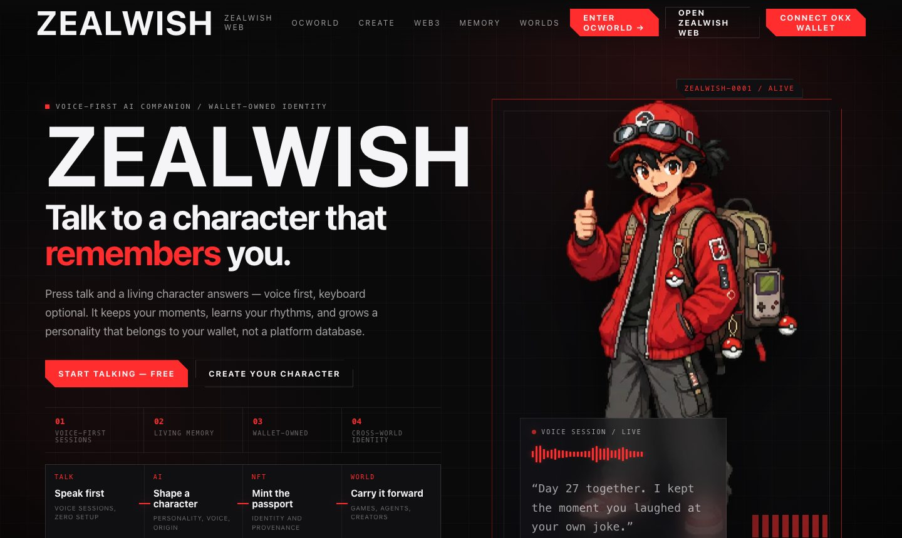<br/>**落地页** —— 品牌与产品叙事 | 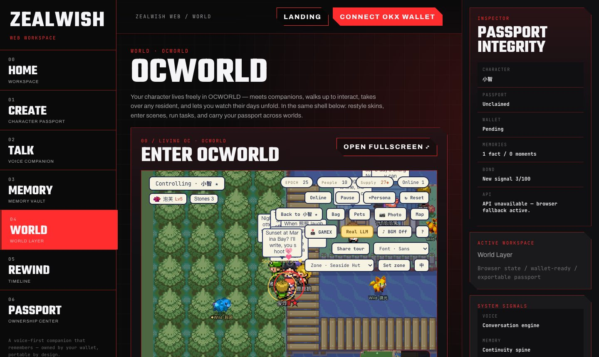<br/>**工作台** —— 创建角色 → 进入世界 |
| 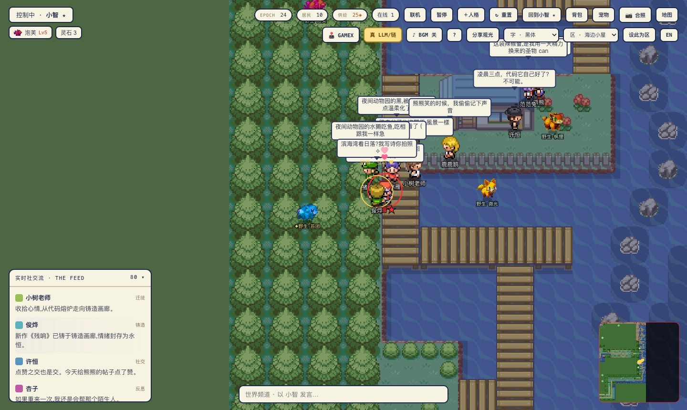<br/>**OCWORLD** —— 海边小镇、居民与野生宠物(注意 ✦ 闪光) | 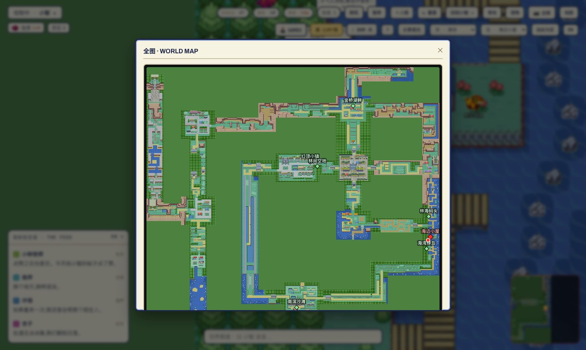<br/>**全图** —— 点击任意处即可迁移 |
| 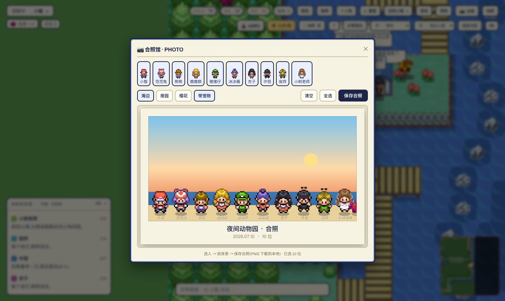<br/>**合照馆** —— 全员 10 人,宝丽来导出 | 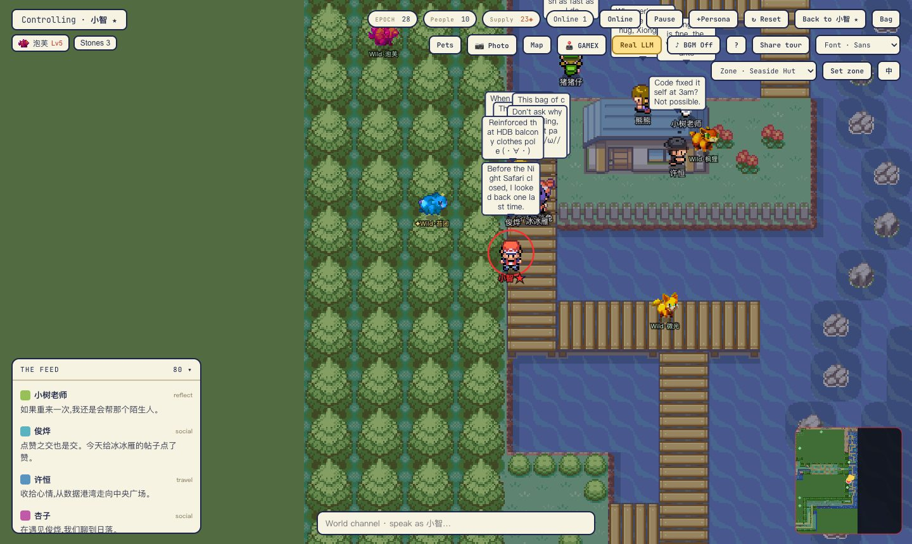<br/>**英文模式** —— 界面 + 台词全量本地化 |

---

## 4. 🟩 快速开始

```bash
git clone <本仓库> && cd ZEALWISH-WEB3

# ① 落地页 + 工作台 + 游戏(零构建 —— 直接跑已提交的生产构建)
python3 -m http.server 8790 --bind 127.0.0.1 --directory frontend-v4
# → http://127.0.0.1:8790            (落地页)
# → http://127.0.0.1:8790/web.html   (工作台)
# → http://127.0.0.1:8790/world/     (OCWORLD)

# ② OCWORLD 开发(热更新)
cd living-oc && npm install && npm run dev     # → http://localhost:5173
npx vitest run                                  # 13 项确定性测试
npx vite build                                  # 构建产物输出到 ../frontend-v4/world/
```

<details>
<summary><b>可选:全球联机(Supabase)</b></summary>

游戏内点 **联机**,粘贴一个免费 Supabase 项目的 URL 与 anon public key(均为可公开的客户端密钥)。留空则为本机多窗口模式。玩家 id 最小者成为权威主机,其余端镜像其世界。

</details>

---

## 5. 🟦 架构

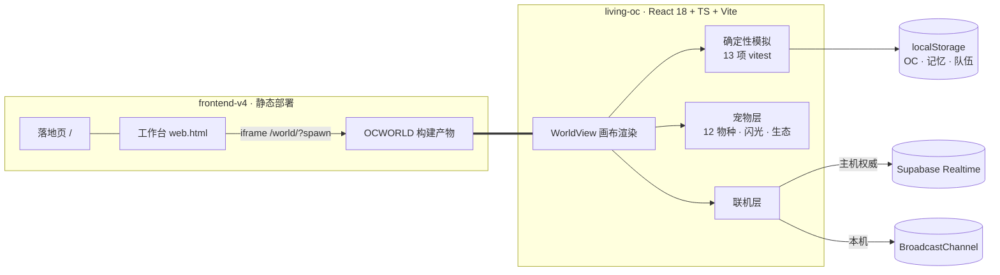

- **双应用模型** —— `living-oc`(Vite)构建进 `frontend-v4/world/`;`frontend-v4` 作为单一静态站点部署
- **玩家本地宠物层** —— 宠物/背包/闪光挂在 OC 上存 localStorage,永不进入确定性世界态
- **同步白名单** —— 只有具名居民参与主机同步;你的 OC 始终归你

---

## 6. 🟪 仓库结构

```
frontend-v4/     ★ 部署静态站:落地页 + 工作台 + OCWORLD 构建产物
living-oc/       ★ OCWORLD 源码 —— 模拟引擎、世界渲染、宠物、i18n、测试
src/ electron/   桌面应用外壳(React + Electron)—— 早期界面
hermes-agent/    本地 AI 运行时(LLM / 语音 / 图像扩展点)
ocworld-web/     独立 Web 应用实验(Express + Vite)
oc-data/         本地优先的角色/记忆数据 + 头像
docs/            📚 产品文档 · deck/(路演) · media/(logo、MV) · images/(截图、概念图)
demos/           可交互 HTML 演示(成长卡、人生 RPG 概念、路线图)
api/ cli/ scripts/ tests/   后端路由、CLI、工具
```

---

## 7. 🟫 素材库

| 分类 | 文件 | 说明 |
|---|---|---|
| 🎬 品牌 MV | [`docs/media/zealwish-mv-720p.mp4`](docs/media/zealwish-mv-720p.mp4) | 720p,约 35 MB(顶部有 GIF 预览) |
| 🎤 路演 Deck | [`docs/deck/ZEALWISH_Pitch_UCWS2026.pdf`](docs/deck/ZEALWISH_Pitch_UCWS2026.pdf) · [`.pptx`](docs/deck/ZEALWISH_Pitch_UCWS2026.pptx) | UCWS 新加坡 2026 |
| 📄 一页纸 | [`docs/deck/ZEALWISH_OnePager.pdf`](docs/deck/ZEALWISH_OnePager.pdf) | 投资人一页纸 |
| 🎨 概念图 | [`docs/images/concept/`](docs/images/concept) | 品牌海报 · 架构/用户旅程信息图 · UI 原型 |
| 🧪 HTML 演示 | [`demos/`](demos) | 成长陪伴、人生 RPG、路线图(浏览器直接打开) |
| 📚 产品文档 | [`docs/`](docs) | 记忆层设计、隐形成长系统、产品审计 |

<div align="center">
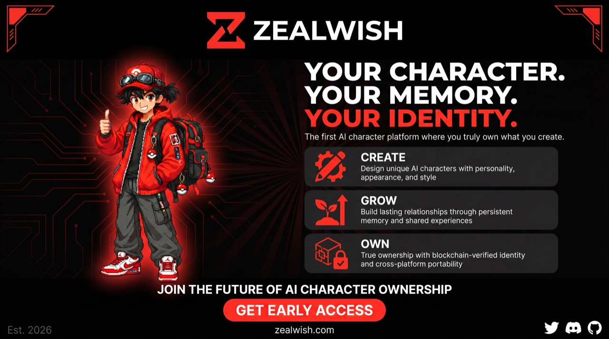 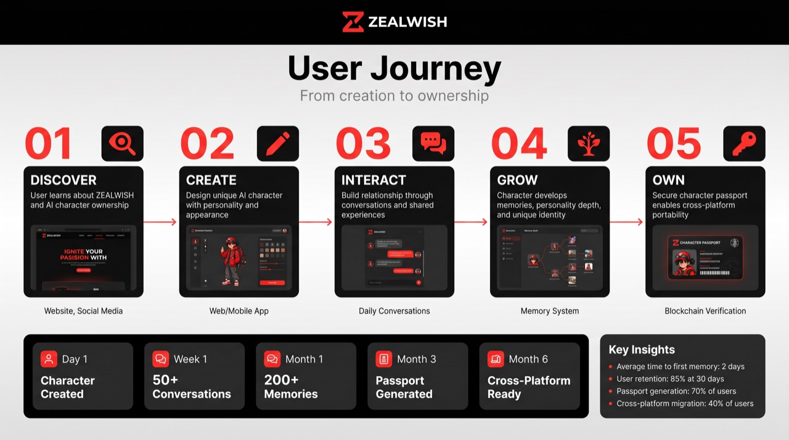
<br/><sub>价值主张海报 · 用户旅程信息图 —— 更多见 <a href="docs/images/concept">docs/images/concept</a></sub>
</div>

---

## 8. ⬛ 路线图

- [x] OCWORLD 核心:确定性模拟 · 10 位居民 · 双语台词库
- [x] 联机(Supabase Realtime 主机权威)+ 世界频道
- [x] 宠物收集:12 物种 · 生态分布 · 闪光变体 · 音效
- [x] 合照馆 · 全图旅行 · GAMEX 游戏厅入口 · 中/EN 切换
- [ ] 宠物图鉴(收集进度 + 闪光标记)
- [ ] 角色护照 mint v1(钱包所有制身份)
- [ ] 公开 Demo 地址 + 一键上手
- [ ] 全员真 LLM 对话(StepFun / OpenAI 兼容后端)
- [ ] 创作者市场 beta(皮肤 / 人格)

---

## 9. ⬜ 致谢与许可

| 素材 | 来源 | 许可 |
|---|---|---|
| 宠物精灵图(12 物种) | [Pixel Mons](https://akoro.itch.io/pixel-mons-52-monsters-size-24x24) by **Akoro** | 免费版,可商用,署名致谢 —— 见 [`ATTRIBUTION.md`](living-oc/public/sprites/spirits/ATTRIBUTION.md) |
| 像素中文字体 | [Fusion Pixel Font](https://github.com/TakWolf/fusion-pixel-font) by **TakWolf** | OFL-1.1 —— 见 [`pixel.OFL.txt`](living-oc/public/fonts/pixel.OFL.txt) |
| 世界地图与基础人物精灵 | FRLG 衍生(经 pret/pokefirered) | **非商业粉丝使用** —— 完整披露见 [`ASSETS-NOTICE.md`](living-oc/public/sprites/ASSETS-NOTICE.md) |
| 其余一切(代码、UI、角色、世界观、物种设计) | 本项目 | 原创 |

> [!WARNING]
> 本项目为活跃原型。钱包/身份层为产品架构与路线图 —— **原型不包含任何金融功能。** 地图/基础精灵美术为已披露的粉丝使用,不用于商业发行。

---

<p align="center"><sub>© ZEALWISH · A life you own. · <a href="README.md">English →</a></sub></p>
